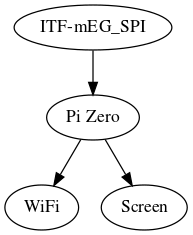

# Module: Croaker

## Name

[`MDL-probe_echomods_controler_croaker`]()

## Title

The controler heart of the echOmods

## Description

* A Pi/BBB/STM32...
* version: V0.1
* date: 27/06/2016
* technology: n/a
* language: n/a
* author: Kelu124

## IOs

### Inputs

* `ITF-A_gnd`
* `ITF-B_5v`
* `ITF-mEG_SPI` : signal from the ADC

### Outputs

* `ITF-mED-TFT-Screen`
* `ITF-mEC-WiFi-UDP-Stream`
* `ITF-I_pulse_on`
* `ITF-J_pulse_off`

## Key Components

* `BBB` : see notes
* `Pi Zero` : see notes

## Information

### What is it supposed to do?

The aim of this echOmod is to receive the signal and process it.

### How does it work: block diagram

* `ITF-mEG_SPI`->`BBB`->`WiFi`
* `BBB`->`ITF-mED-TFT-Screen`
* `BBB`->`ITF-mEC-WiFi-UDP-Stream`

## About the module

### Pros

* Building on existing techs and communities

### Cons

* Need to find a real-time solution

### Constraint and limits

* A series of work has been done on ,  , , . The EMW3165 gave birth to __[Kina](/kina/)__ for slow speed wireless UDP streaming.
* A recap of microcontrolers has been added [here](notes_uC.md)

## Discussions

### TODO

* Getting some PRU code
* Getting some images
* Getting images onto a screen
* Replace the work done by [OneEye](/oneeye/) by [Croaker](/croaker/).

### DONE

* Choose the platform (BBB, RPi0, STM32, ... ?) : that'll be BBB

### People

* ??

## License

### Croaker 

The [echOmods project](https://github.com/kelu124/echomods) and its prototypes (amongst which we find the [croaker](/croaker/) module) are open hardware, and working with open-hardware components.

Licensed under TAPR Open Hardware License (www.tapr.org/OHL)

Copyright Kelu124 (luc@echopen.org / kelu124@gmail.com ) 2015-2018

### Based on 

The following work is base on a previous TAPR project, [Murgen](https://github.com/kelu124/murgen-dev-kit) - and respects its TAPR license.

Copyright Murgen and Kelu124 (murgen@echopen.org , luc@echopen.org / kelu124@gmail.com ) 2015-2018

