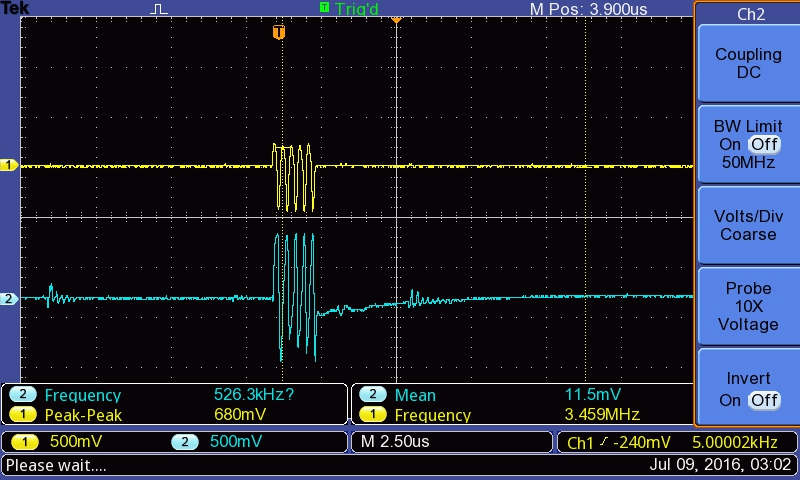
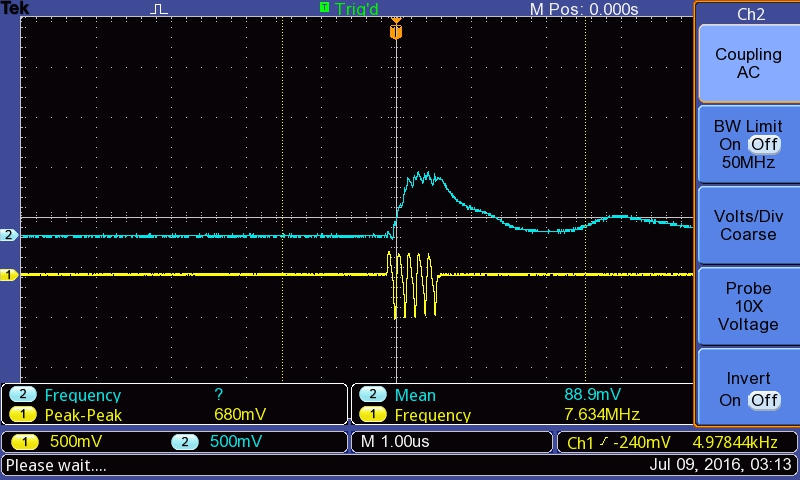
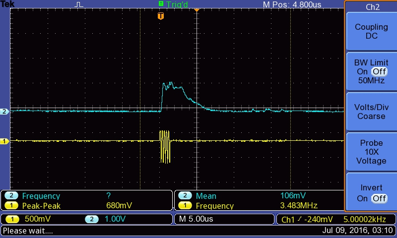

# Module: Goblin

## Detailed view

### Explained

### Schematics

## Name

[`MDL-goblin_tgcenvadc`]()

## Title

Goblin: a TGC-Envelop-ADC module

## Description

* The analog signal-processing heart of the echOmods
* version: V0.1
* date: 24/04/2016
* technology: Module-compatible, Homemade PCB, ICs based on `AD8331` and `ADL5511`
* language: Altium
* author: Kelu124

## IOs

### Inputs

* `ITF-A_gnd`
* `ITF-B_5v`
* `ITF-S_3_3v`
* `ITF-G_gain_control`
* `ITF-InternalPot1_gain_control`
* `ITF-C_amplified_raw_signal` : because it's used internally
* `ITF-E_signal_envelope` : because it's used internally
* `ITF-R_reserved` : for the signal coming from the pulser (if through track R)
* `ITF-InternalPot2_ADC_Vref`
* `ITF-mET_SMA` : for the signal coming from the pulser (if through SMA)

### Outputs

* `ITF-C_amplified_raw_signal`: Amplified Raw Signal, post TGC, before `ADL5511`
* `ITF-E_signal_envelope`: enveloppe of the signal, post TGC
* `ITF-mEG_SPI` : signal from the ADC

## Key Components

* `ADL5511`: Enveloppe detection 
* `AD8331`: TGC
* `AD7274`: 2Msps SPI ADC

## Information

### What is it supposed to do?

The aim of this echOmod is to get the signal coming back from a transducer, and to deliver the signal, analogically processed. 

With more details, this [Goblin](/goblin/) board aims at getting a signal, and giving access to key points within the signal processing chain for ultrasound imaging, namely:

* Getting access to a TGC
* Getting the enveloppe of the signal
* Cleaning the signal before feeding in the on-board SPI ADC

All key signals are accessible, and jumpers, as well as pots, enable on-board fine-tuning of the signals. [See more details on the __testing session__, to see the behavior of the board on a oscillo](/goblin/2016-07-08.md).

It's also a first try at a SPI ADC. Using a up to 3 Msps one in order to catch only the enveloppe, to be tested with other uC, RPi or BBB. 

### How does it work: block diagram

* `ITF-G_gain_control`->`Goblin_Jumper2`->`AD8331`->`ITF-C_amplified_raw_signal`->`ADL5511`->`ITF-E_signal_envelope`->`AD8691`->`ITF-Ext_Amplified`->`AD7274`->`ITF-mEG_SPI`
* `ITF-R_reserved`->`Goblin_Jumper1`->`AD8331`
* `ITF-mET_SMA`->`Goblin_Jumper1`
* `ITF-InternalPot1_gain_control`->`Goblin_Jumper2`
* `ITF-InternalPot2_ADC_Vref`->`AD7274`
* `ADL5511`->`Int-Offset`->`AD8691`

## About the module

### Pros

* Only needs 5V and 3.3V
* Energy use : TODO
* ADC V_REF is flexible: better resolution in output of the ADC
* E_REF is being removed from the signal output, better than Murgen, where we lost 1.1V from the signal

### Cons

* Takes a lot of space because of the modularity. Jumpers and pots could be removed.
* Little flexibility from the use of ICs.

## Constraint and limits

### Tests

#### Signal in vs Signal out of the TGC

#### Trying with different frequencies

##### At 3 MHz

##### At 5MHz

##### At 7.5MHz

##### At 10MHz

#### Difference between enveloppe and ADC input?

-> the offset is removed, there's also a small gain (x2).

See below: there's an offset at the enveloppe detection (~RMS), which is removed. Enveloppe is 500mV before, comes at 1V+ afterwards.

##### Before the AOP

##### After the AOP

## Discussions

### TODO

* Send microcircuits to Edgeflex
* Receive the module
* Plug it to a RPi0 or BBB or RPi or ...
* Publish the sources in KiCAD

### DONE

* Specs to write
* Agreeing on the strips 
* Defining the ICs to use
* Getting schematics

### People

* Sofian (for preparing the field with Murgen)

## License

### Goblin 

The [echOmods project](https://github.com/kelu124/echomods) and its prototypes (so Goblin) are open hardware, and working with open-hardware components.

Licensed under TAPR Open Hardware License (www.tapr.org/OHL)

Copyright Kelu124 (luc@echopen.org / kelu124@gmail.com ) 2015-2018

### Based on 

The following work is base on a previous TAPR project, [Murgen](https://github.com/kelu124/murgen-dev-kit) - and respects its TAPR license.

Copyright Murgen and Kelu124 (murgen@echopen.org , luc@echopen.org / kelu124@gmail.com ) 2015-2018
