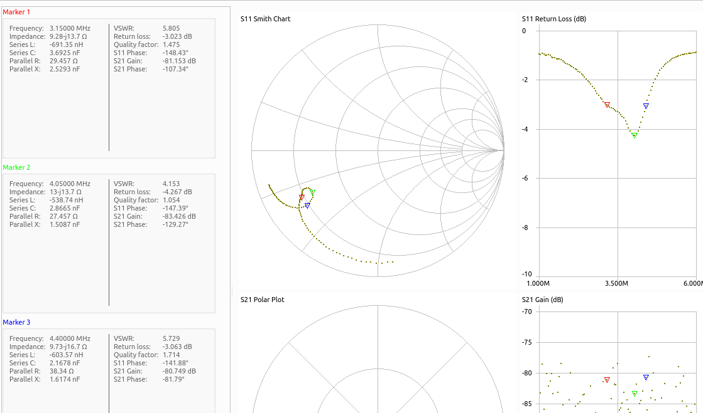
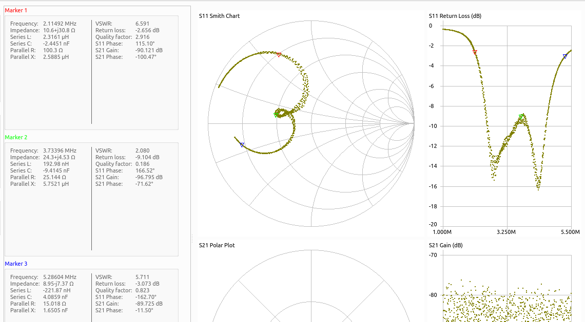
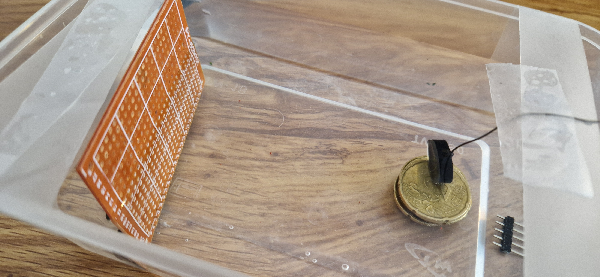
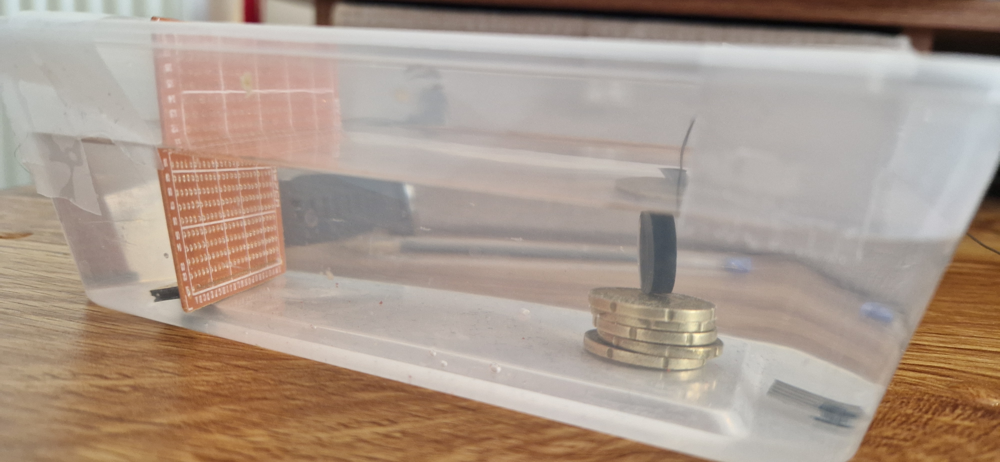
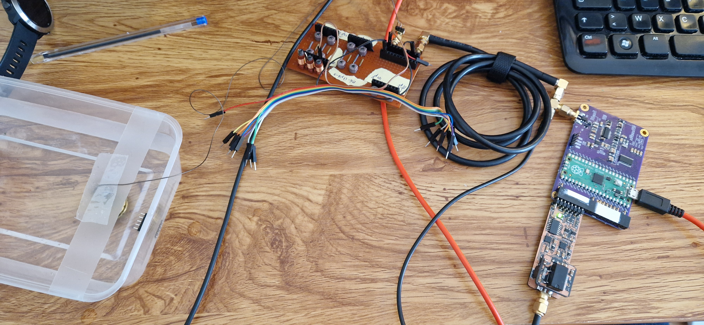
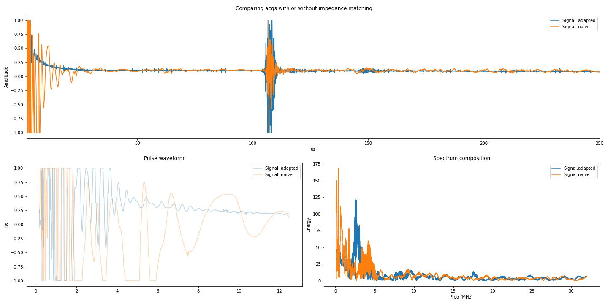
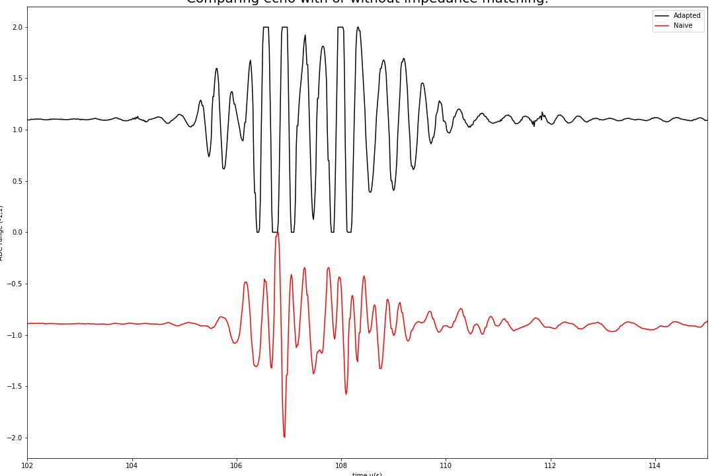

# `20240604a` tests with impedance matching.

So, I've got a couple of piezos to test.
* Small (~7MHz)
* Medium (~5MHz)
* Small (~3MHz)
and I want to test electrical impedance matching. I've done some tests in the past, but hopefully we can go a bit more into the details.

The piezo related data are stored in [this folder](piezos/) for reference. I'll focus on the 3MHz one for this experiment.

# The piezo

So, I started with checking its Smith chart profile (also as a [s1p file](piezos/big.s1p)):

And, playing with Ls, I've added one to ground, something I've seen in a couple of probes.

Cool! We're going from a -4dB loss at 4MHz to something less cute but around -10 to -16dB between 2 to 5MHz. That's a 3MHz bandwidth for a central freq at 3.5MHz... better (possibly, depends on the piezo datasheet) ! 

# Acquisitions

## Setup

Crappy setup, noisy, but ... fast.

### Top view of the piezo + bath

### Side view of the piezo + bath

### Overview with (crap) network and acq board

## Results

The results are consistent with the smith chart we've seen for the adapted system. Echo is larger, saturates more. Looses a bit of frequency, but linked to a larger bandwidth.

### Overview

### Details

