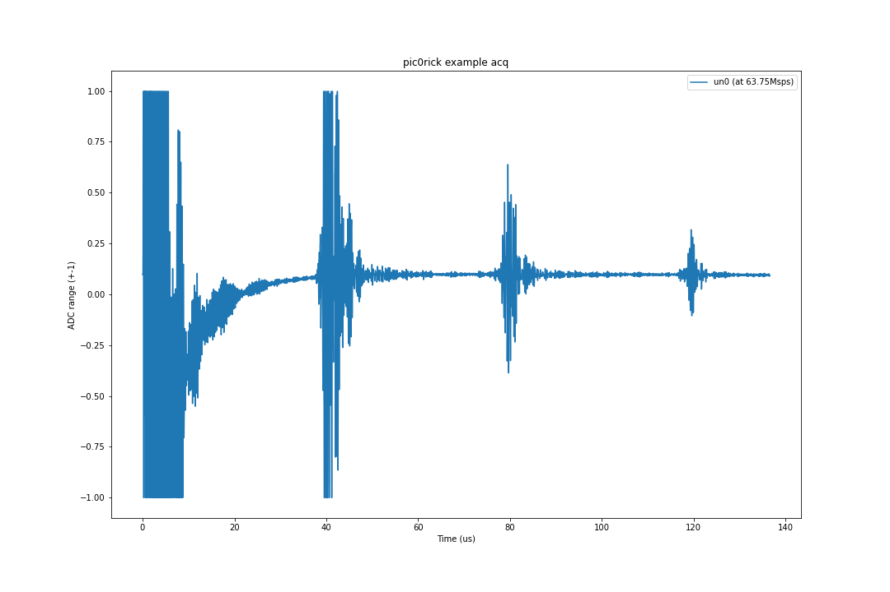
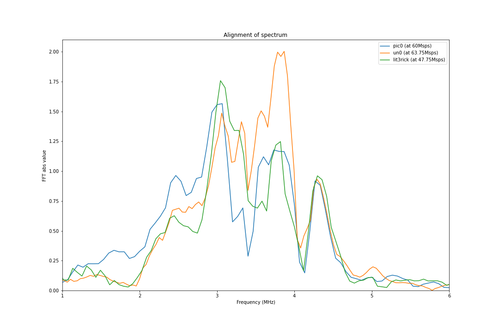
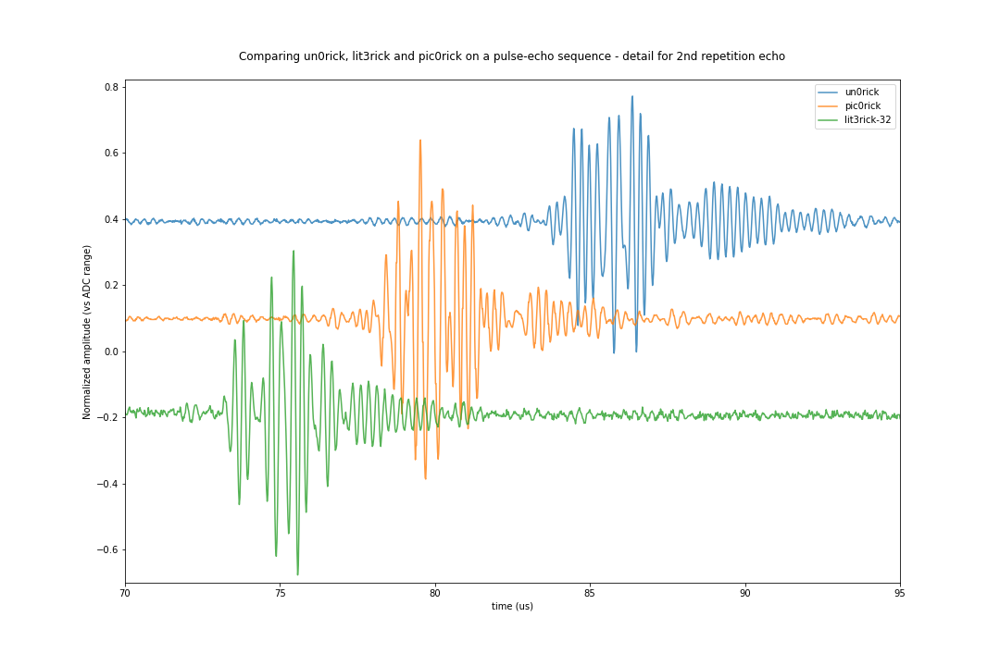
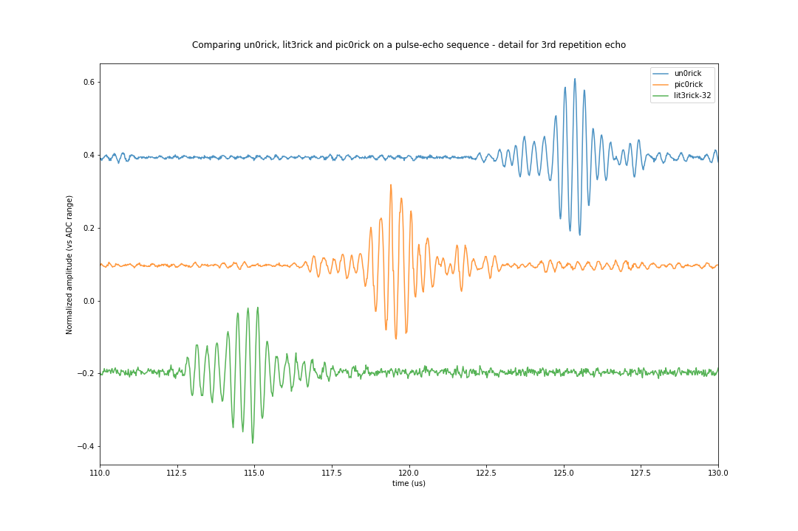

# `20240413a` Testing benchmarks of pic0

Comparing pic0, un0 and lit32 boards on the same pulse echo.

## Signal from pic0

## Alignment of frequencies

# Echoes details

## 2nd repeat echo

## 3rd repeat echo

