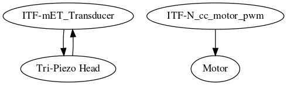

# Module: Retro10PV

## Name

[`MDL-probe_retro10PV`]()

## Title

Retrohacking the probe

## Description

* Retroengineering of 10PV
* version: V0.1
* date: 18/06/2016
* technology: Hacking the ATL10PV
* language: n/a
* author: Kelu124

## IOs

### Inputs

* `ITF-A_gnd`
* `ITF-F_12V`
* `ITF-N_cc_motor_pwm`
* `ITF-mET_Transducer`
* `Motor`
* `Tri-Piezo Head`

### Outputs

* `Motor`
* `ITF-mET_Transducer`
* `Tri-Piezo Head`

## Key Components

* `ATL10PV`

## Information

### What is it supposed to do?

The aim of this echOmod is to get the mechanical movement of the piezos. Salvaged from a former [ATL10PV](http://echopen.org/index.php/ATL_Access_10PV).

### How does it work: block diagram

* `ITF-mET_Transducer`->`Tri-Piezo Head`->`ITF-mET_Transducer`
* `ITF-N_cc_motor_pwm`->`Motor`

## About the module

### Pros

* Simple to use

### Cons

* We have removed the position system : we don't have the encoding system
* Tough to find a old 10PV probe

### Constraint and limits

* Motor is a 12V... doesn't move below 10V ... using 300mA@10V -- we could use a [5V to 12V DC/DC boost similar to this one](https://www.pololu.com/product/2117/specs). Could feed onto the 5V entry and leave on the 12V output. Can be found on Gotronics and such. Or the 12V could be delivered to the board itself.
* 3 piezos are fixed frequency
* Oil to be found to replace lost one =) Feeback: linseed oil seems good !

* Tested with murgen : not really pratical to use, maybe to be replaced with a simple 3MHz probe. [Read the full test on murgen's repo](https://github.com/kelu124/murgen-dev-kit/blob/master/worklog/Session_9_ATL.md).

* __It seems that the noise previously seen with the bitscope was due to the computer! Not to the bitscope.__
* We have found an interesting doc: the ATL manual for the ultrasound machine - and specs for the whole set of transducers -- [found here](doc/4692-2615.pdf)

## Discussions

### What is inside?

### Cleaning and creation the connections

### Use of the probe

### Signals

### TODO

* Control the motor with a 12V PWM
* Integrate 12V+PWM in the probe body

### DONE

* Put plugs into the probe body
* Repair the probe
* Simplify it

### People

* BiVi

## License

### Retro10PV 

The [echOmods project](https://github.com/kelu124/echomods) and its prototypes (amongst which we find the [retro10PV](/retro10PV/) module) are open hardware, and working with open-hardware components.

Licensed under TAPR Open Hardware License (www.tapr.org/OHL)

Copyright Kelu124 (luc@echopen.org / kelu124@gmail.com ) 2015-2018

### Based on 

The following work is base on a previous TAPR project, [Murgen](https://github.com/kelu124/murgen-dev-kit) - and respects its TAPR license.

Copyright Murgen and Kelu124 (murgen@echopen.org , luc@echopen.org / kelu124@gmail.com ) 2015-2018

