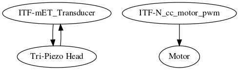

# Module: retro10PV

* Retroengineering of 10PV
* version: V0.1
* date: 18/06/2016
* technology: Hacking the 10PV
* language: n/a
* author: Kelu124

# Information

## What is it supposed to do ?

The aim of this echOmod is to get the rotation and getting the piezos.

## How does it work: block diagram

* `ITF-mET_Transducer`->`Tri-Piezo Head`->`ITF-mET_Transducer`
* `ITF-N_cc_motor_pwm`->`Motor`

# IOs

## Inputs

* `ITF-A_gnd`
* `ITF-N_cc_motor_pwm`
* `ITF-mET_Transducer`
* `Motor`
* `Tri-Piezo Head`

## Outputs

* `Motor`
* `ITF-mET_Transducer`
* `Tri-Piezo Head`

# Key Components

* `ATL10PV`

# Pros & Cons

## Pros

* Simple to use

## Cons

* We have removed the position system : we don't have the encoding system
* Tough to find a old 10PV probe

## Constraint and limits

* Motor is a 12V... doesn't move below 10V ... using 300mA@10V
* 3 piezos are fixed frequency
* Oil to be found to replace lost one =)
# Discussions

## What is inside?

## Cleaning and creation the connections

## Use of the probe

## Signals

# License

## echOmods 

The [echOmods project](https://github.com/kelu124/echomods) and its prototypes (amongst which we find the [retro10PV](/retro10PV/) module) are open hardware, and working with open-hardware components.

Licensed under TAPR Open Hardware License (www.tapr.org/OHL)

Copyright Kelu124 (luc@echopen.org / kelu124@gmail.com ) 2015-2018

## Based on 

The following work is base on a previous TAPR project, [Murgen](https://github.com/kelu124/murgen-dev-kit) - and respects its TAPR license.

Copyright Murgen and Kelu124 (murgen@echopen.org , luc@echopen.org / kelu124@gmail.com ) 2015-2018
