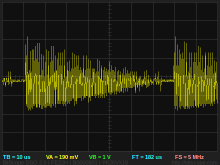

# Module: Silent

## Name

[`MDL-echomods_emulator`]()

## Title

This is the module which emulates the signal coming from the analog processing chain.

## Description

* Teensy for its DAC.
* version: V0.1
* date: 26/07/2016
* technology: Adafruit Feather
* language: C
* author: Kelu124

## IOs

### Inputs

* `ITF-A_gnd`
* `ITF-B_5v`
* `ITF-S_3_3v`
* `ITF-I_pulse_on`
* `ITF-J_pulse_off`

### Outputs

* `ITF-E_signal_envelope`

## Key Components

* `Feather WICED`

## Information

### What is it supposed to do?

The aim of this echOmod is to simulate the enveloppe (or maybe soon the raw signal) that would come from the piezo and analog chain.

### How does it work: block diagram

* `ITF-B_5v`->`Feather WICED`->`DAC`->`ITF-E_signal_envelope`
* `ITF-I_pulse_on`->`Feather WICED`

## About the module

### Pros

* TBD

### Cons

* TBD

### Constraint and limits

### Why a Teensy ?

Simplement (TEENSY) pour émuler un signal. A "high" speed DAC is required. Since the acquisition period is 200us, we should have say 2 periods over this, hence a period of 100us, that's a 10kHz signal we should see. At 20 pts per period, we should have roughly a 200kHz DAC.
* https://www.pjrc.com/teensy/td_timing_elaspedMillis.html
* https://forum.pjrc.com/attachment.php?attachmentid=2790&d=1413271011
* Pin Change teensy: https://www.pjrc.com/teensy/interrupts.html

#### Why not a Feather WICED ?

* [Fading](https://github.com/adafruit/Adafruit_WICED_Arduino/blob/master/examples/Hardware/PWM/Fading/Fading.ino) as well 
* IT has two DACs : see [here](https://cdn-learn.adafruit.com/assets/assets/000/031/391/medium800/adafruit_products_WICEDPinout.jpg?1458753854) 

With a simple code, managed to get a 1.8Mhz signal ( [code is here](software/featherWICED/SimpleSignalGenerator.ino) ).

## Discussions

### TODO

* Feather: work with an interrupt

### DONE

* write code for feather
* publish this code
* Validated with a Feather WICED ([code](software/featherWICED/SimpleSignalGenerator.ino)).
* Feather: remove the average value before inputing in Goblin 

### People

* Kelu

## License

### Silent 

The [echOmods project](https://github.com/kelu124/echomods) and its prototypes (amongst which we find the [silent](/silent/) module) are open hardware, and working with open-hardware components.

Licensed under TAPR Open Hardware License (www.tapr.org/OHL)

Copyright Kelu124 (luc@echopen.org / kelu124@gmail.com ) 2015-2018

### Based on 

The following work is base on a previous TAPR project, [Murgen](https://github.com/kelu124/murgen-dev-kit) - and respects its TAPR license.

Copyright Murgen and Kelu124 (murgen@echopen.org , luc@echopen.org / kelu124@gmail.com ) 2015-2018

