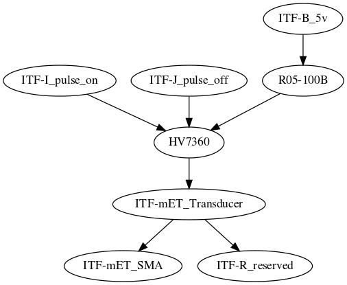
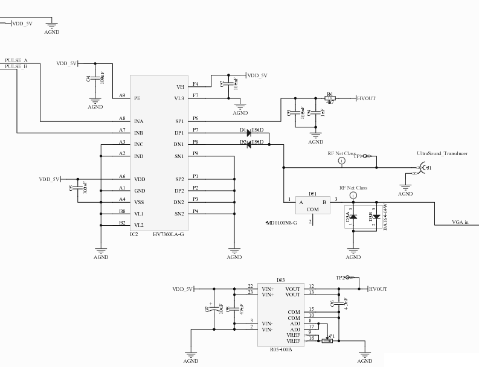
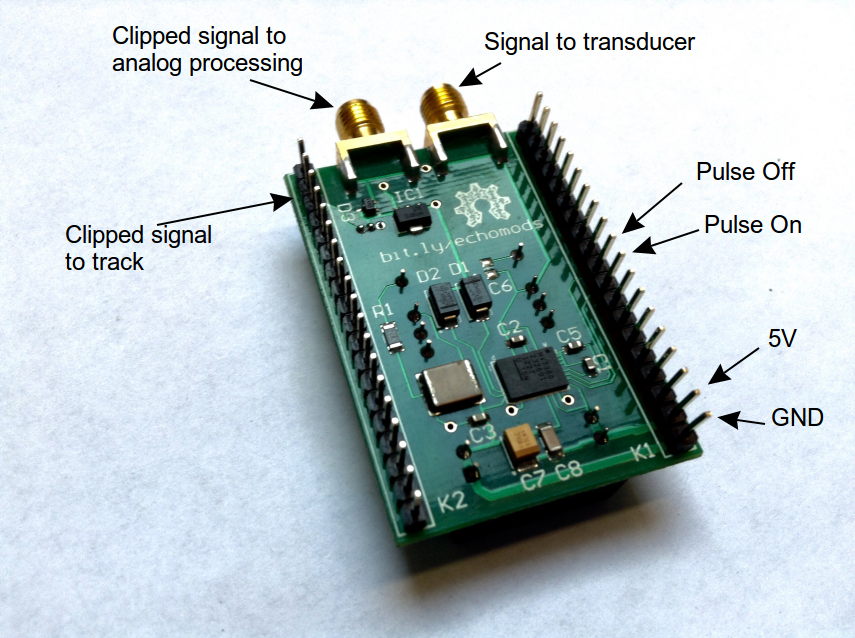

# Module: Tobo

## Name

[`MDL-tobo_hvpulser`]()

## Title

Tobo: the HV-pulser

## Description

* The HV-Pulser of the echOmods
* version: V0.2
* cost:120$
* sourcing:Custom made, get the [Gerbers](/tobo/source/), or contact @kelu124
* date: 24/04/2016
* technology: Module-compatible, Homemade PCB, ICs based on `HV7360` and `R05-100B`
* language: Altium
* author: Kelu124

## IOs

### Inputs

* `ITF-A_gnd`
* `ITF-B_5v`
* `ITF-I_pulse_on`
* `ITF-J_pulse_off`
* `ITF-S_3_3v`
* `ITF-mET_Transducer` : signal coming back	

### Outputs

* `ITF-R_reserved` : for the signal coming from the transducer
* `ITF-mET_SMA` : for the signal coming out to the signal processing (if through SMA)
* `ITF-mET_Transducer` : for the signal coming out of the pulser (if through SMA)

## Key Components

* `HV7360`
* `R05-100B`

## Information

### What is it supposed to do?

The aim of this echOmod is to get the HV Pulse done.

### How does it work: block diagram

* `ITF-I_pulse_on`->`HV7360`
* `ITF-J_pulse_off`->`HV7360`
* `ITF-B_5v`->`R05-100B`->`HV7360`->`ITF-mET_Transducer`
* `ITF-mET_Transducer`->`ITF-mET_SMA`
* `ITF-mET_Transducer`->`ITF-R_reserved`

## About the module

### Pros

* Only needs 5V and 3.3V
* Energy use : TODO
* Using any logic voltage for PulseOn and PulseOff is a pplus
* Can use the potentiometer to control the tension
* Modularity through jumpers and SMA

### Cons

* Takes a lot of space because of the modularity. SMA, jumpers and pots could be removed.
* HV7360 seems to be running out, production may be stopping (on end of summer 2016). Need to find a replacement for it. 
* Little flexibility from the use of ICs.
* There's no impedance matching for the pulser to the transducer, could be better.

## Constraint and limits

### Look of the schematics

and [a link to it](tobo_schematics.pdf)

### Look of the actual board

## Discussions

Some issues with the availability of the `HV7360`, living its end of life.

### TODO

* Publish the sources in KiCAD

### DONE

* Writing specs 
* Sending microcircuits to Edgeflex
* Agreeing on the strips/tracks 
* Defining the ICs to use to pulse
* Getting schematics
* Publishing schematics
* Receive the module
* Test it with different transducers

### People

* Sofian (for preparing the field with Murgen)

## License

### echOmods 

The [echOmods project](https://github.com/kelu124/echomods) and its prototypes (amongst which we find the [Tobo](/tobo/) module) are open hardware, and working with open-hardware components.

Licensed under TAPR Open Hardware License (www.tapr.org/OHL)

Copyright Kelu124 (luc@echopen.org / kelu124@gmail.com ) 2015-2018

### Based on 

The following work is base on a previous TAPR project, [Murgen](https://github.com/kelu124/murgen-dev-kit) - and respects its TAPR license.

Copyright Murgen and Kelu124 (murgen@echopen.org , luc@echopen.org / kelu124@gmail.com ) 2015-2018

